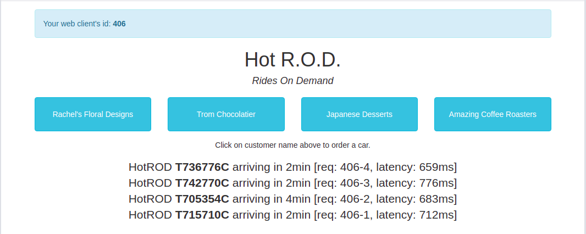
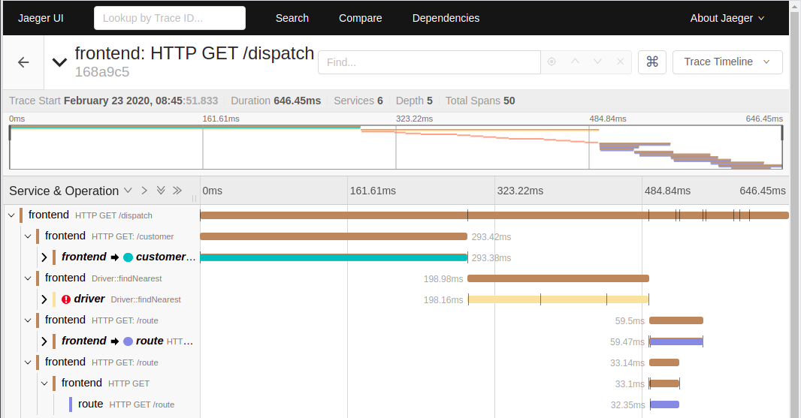

## Install

### Follow the steps:
https://kind.sigs.k8s.io/docs/user/ingress/  
https://github.com/jaegertracing/jaeger-operator  

### Create a kind cluster with extraPortMappings and node-labels.

* extraPortMappings allow the local host to make requests to the Ingress controller over ports 80/443
* node-labels only allow the ingress controller to run on a specific node(s) matching the label selector

```yaml
cat <<EOF | kind create cluster --config=-
kind: Cluster
apiVersion: kind.x-k8s.io/v1alpha4
nodes:
- role: control-plane
  kubeadmConfigPatches:
  - |
    kind: InitConfiguration
    nodeRegistration:
      kubeletExtraArgs:
        node-labels: "ingress-ready=true"
        authorization-mode: "AlwaysAllow"
  extraPortMappings:
  - containerPort: 80
    hostPort: 80
    protocol: TCP
  - containerPort: 443
    hostPort: 443
    protocol: TCP
EOF
```

### Install Contour

Install Contour and Apply kind specific patches to forward the hostPorts to the ingress controller, set taint tolerations and schedule it to the custom labelled node.

```
kubectl apply -f https://projectcontour.io/quickstart/contour.yaml
kubectl patch daemonsets -n projectcontour envoy -p '{"spec":{"template":{"spec":{"nodeSelector":{"ingress-ready":"true"},"tolerations":[{"key":"node-role.kubernetes.io/master","operator":"Equal","effect":"NoSchedule"}]}}}}' 
```

### Install Jaeger 

```
kubectl create namespace observability
kubectl create -f install_jaeger/jaegertracing.io_jaegers_crd.yaml
kubectl create -f install_jaeger/service_account.yaml
kubectl create -f install_jaeger/role.yaml
kubectl create -f install_jaeger/role_binding.yaml
kubectl create -f install_jaeger/operator.yaml
```

Once the jaeger-operator deployment in the namespace observability is ready, create a Jaeger instance, like:

```
kubectl apply -f - <<EOF
apiVersion: jaegertracing.io/v1
kind: Jaeger
metadata:
  name: simplest
EOF
```

At this point you should be abel to access Jager UI by localhost

```
$ kubectl get ingress
NAME             HOSTS   ADDRESS   PORTS   AGE
simplest-query   *                 80      11m
```

### Create example-hotrod deployment  

Using https://hub.docker.com/r/jaegertracing/example-hotrod

```
$ kubectl apply -f hotrod-deployment.yaml
```

The deployment looks like:

```yaml
apiVersion: apps/v1
kind: Deployment
metadata:
  labels:
    app.kubernetes.io/component: hotrod
    app.kubernetes.io/instance: jaeger
  name: jaeger-hotrod
  namespace: default
spec:
  replicas: 1
  selector:
    matchLabels:
      app.kubernetes.io/component: hotrod
      app.kubernetes.io/instance: jaeger
      app.kubernetes.io/name: jaeger
  template:
    metadata:
      labels:
        app.kubernetes.io/component: hotrod
        app.kubernetes.io/instance: jaeger
        app.kubernetes.io/name: jaeger
    spec:
      containers:
      - env:
        - name: JAEGER_AGENT_HOST
          value: simplest-agent.default.svc.cluster.local
        - name: JAEGER_AGENT_PORT
          value: "6831"
        image: jaegertracing/example-hotrod:latest
        imagePullPolicy: Always
        livenessProbe:
          httpGet:
            path: /
            port: 8080
        name: jaeger-hotrod
        ports:
        - containerPort: 8080
        readinessProbe:
          httpGet:
            path: /
            port: 8080
```

At this stage you should see:

```
$ kubectl get pods --all-namespaces
NAMESPACE            NAME                                         READY   STATUS      RESTARTS   AGE
default              jaeger-hotrod-85df697fc9-7jzz8               1/1     Running     0          23m
default              simplest-59875cd85-48nzn                     1/1     Running     0          65m
kube-system          coredns-6955765f44-5k7dz                     1/1     Running     0          66m
kube-system          coredns-6955765f44-vkrfg                     1/1     Running     0          66m
kube-system          etcd-kind-control-plane                      1/1     Running     0          67m
kube-system          kindnet-8vzb7                                1/1     Running     0          66m
kube-system          kube-apiserver-kind-control-plane            1/1     Running     0          67m
kube-system          kube-controller-manager-kind-control-plane   1/1     Running     0          67m
kube-system          kube-proxy-b9rg4                             1/1     Running     0          66m
kube-system          kube-scheduler-kind-control-plane            1/1     Running     0          67m
local-path-storage   local-path-provisioner-7745554f7f-92djr      1/1     Running     0          66m
observability        jaeger-operator-5cc9697959-h6sqr             1/1     Running     0          66m
projectcontour       contour-6c7b6bbbc4-hsbzr                     1/1     Running     0          66m
projectcontour       contour-6c7b6bbbc4-qxr8z                     1/1     Running     0          66m
projectcontour       contour-certgen-6c6vv                        0/1     Completed   0          66m
projectcontour       envoy-rt4sg                                  2/2     Running     0          66m
```

Jaeger all-in-one has started:

```
$ kubectl logs simplest-59875cd85-48nzn
2020/02/23 05:56:42 maxprocs: Leaving GOMAXPROCS=8: CPU quota undefined
{"level":"info","ts":1582437402.5909467,"caller":"flags/service.go:115","msg":"Mounting metrics handler on admin server","route":"/metrics"}
{"level":"info","ts":1582437402.591227,"caller":"flags/admin.go:108","msg":"Mounting health check on admin server","route":"/"}
{"level":"info","ts":1582437402.5912673,"caller":"flags/admin.go:114","msg":"Starting admin HTTP server","http-port":14269}
{"level":"info","ts":1582437402.5912783,"caller":"flags/admin.go:100","msg":"Admin server started","http-port":14269,"health-status":"unavailable"}
{"level":"info","ts":1582437402.5989306,"caller":"memory/factory.go:56","msg":"Memory storage initialized","configuration":{"MaxTraces":0}}
{"level":"info","ts":1582437402.6054704,"caller":"all-in-one/main.go:246","msg":"Starting jaeger-collector TChannel server","port":14267}
{"level":"warn","ts":1582437402.6054945,"caller":"all-in-one/main.go:247","msg":"TChannel has been deprecated and will be removed in a future release"}
{"level":"info","ts":1582437402.6055527,"caller":"grpcserver/grpc_server.go:64","msg":"Starting jaeger-collector gRPC server","grpc-port":"14250"}
{"level":"info","ts":1582437402.605597,"caller":"all-in-one/main.go:265","msg":"Starting jaeger-collector HTTP server","http-port":14268}
{"level":"info","ts":1582437402.6056163,"caller":"grpc/builder.go:65","msg":"Agent requested insecure grpc connection to collector(s)"}
{"level":"info","ts":1582437402.6066933,"caller":"all-in-one/main.go:203","msg":"Starting agent"}
{"level":"info","ts":1582437402.606781,"caller":"querysvc/query_service.go:133","msg":"Archive storage not created","reason":"archive storage not supported"}
{"level":"info","ts":1582437402.6067953,"caller":"all-in-one/main.go:347","msg":"Archive storage not initialized"}
{"level":"info","ts":1582437402.6069145,"caller":"app/agent.go:69","msg":"Starting jaeger-agent HTTP server","http-port":5778}
{"level":"info","ts":1582437402.6077898,"caller":"healthcheck/handler.go:128","msg":"Health Check state change","status":"ready"}
{"level":"info","ts":1582437402.6077976,"caller":"app/server.go:112","msg":"Starting HTTP server","port":16686}
{"level":"info","ts":1582437402.607803,"caller":"app/server.go:125","msg":"Starting GRPC server","port":16686}
{"level":"info","ts":1582437402.6078205,"caller":"app/server.go:135","msg":"Starting CMUX server","port":16686}
{"level":"info","ts":1582437402.6236959,"caller":"all-in-one/main.go:303","msg":"Listening for Zipkin HTTP traffic","zipkin.http-port":9411}
```

Describe the Jaeger container:

```yaml
$ kubectl describe pod simplest-59875cd85-48nzn
Name:         simplest-59875cd85-48nzn
Namespace:    default
Priority:     0
Node:         kind-control-plane/172.17.0.2
Start Time:   Sun, 23 Feb 2020 07:56:37 +0200
Labels:       app=jaeger
              app.kubernetes.io/component=all-in-one
              app.kubernetes.io/instance=simplest
              app.kubernetes.io/managed-by=jaeger-operator
              app.kubernetes.io/name=simplest
              app.kubernetes.io/part-of=jaeger
              pod-template-hash=59875cd85
Annotations:  linkerd.io/inject: disabled
              prometheus.io/port: 14269
              prometheus.io/scrape: true
              sidecar.istio.io/inject: false
Status:       Running
IP:           10.244.0.10
IPs:
  IP:           10.244.0.10
Controlled By:  ReplicaSet/simplest-59875cd85
Containers:
  jaeger:
    Container ID:  containerd://66d970341890c9023e6aca865d98611b85d4723ddf4de88cb6820c8bc0a64bac
    Image:         jaegertracing/all-in-one:1.16.0
    Image ID:      docker.io/jaegertracing/all-in-one@sha256:738442983b772a5d413c8a2c44a5563956adaff224e5b38f52a959124dafc119
    Ports:         5775/UDP, 5778/TCP, 6831/UDP, 6832/UDP, 9411/TCP, 14267/TCP, 14268/TCP, 16686/TCP, 14269/TCP, 14250/TCP
    Host Ports:    0/UDP, 0/TCP, 0/UDP, 0/UDP, 0/TCP, 0/TCP, 0/TCP, 0/TCP, 0/TCP, 0/TCP
    Args:
      --sampling.strategies-file=/etc/jaeger/sampling/sampling.json
    State:          Running
      Started:      Sun, 23 Feb 2020 07:56:42 +0200
    Ready:          True
    Restart Count:  0
    Liveness:       http-get http://:14269/ delay=5s timeout=1s period=15s #success=1 #failure=5
    Readiness:      http-get http://:14269/ delay=1s timeout=1s period=10s #success=1 #failure=3
    Environment:
      SPAN_STORAGE_TYPE:           memory
      COLLECTOR_ZIPKIN_HTTP_PORT:  9411
    Mounts:
      /etc/jaeger/sampling from simplest-sampling-configuration-volume (ro)
      /var/run/secrets/kubernetes.io/serviceaccount from simplest-token-2c7fg (ro)
Conditions:
  Type              Status
  Initialized       True 
  Ready             True 
  ContainersReady   True 
  PodScheduled      True 
Volumes:
  simplest-sampling-configuration-volume:
    Type:      ConfigMap (a volume populated by a ConfigMap)
    Name:      simplest-sampling-configuration
    Optional:  false
  simplest-token-2c7fg:
    Type:        Secret (a volume populated by a Secret)
    SecretName:  simplest-token-2c7fg
    Optional:    false
QoS Class:       BestEffort
Node-Selectors:  <none>
Tolerations:     node.kubernetes.io/not-ready:NoExecute for 300s
                 node.kubernetes.io/unreachable:NoExecute for 300s
Events:          <none>
```

Forward port to container in order to access the application:

```
$ kubectl port-forward jaeger-hotrod-85df697fc9-7jzz8 8080 8080
Forwarding from 127.0.0.1:8080 -> 8080
Forwarding from [::1]:8080 -> 8080
Unable to listen on port 8080: Listeners failed to create with the following errors: [unable to create listener: Error listen tcp4 127.0.0.1:8080: bind: address already in use unable to create listener: Error listen tcp6 [::1]:8080: bind: address already in use]
Handling connection for 8080
Handling connection for 8080
Handling connection for 8080
Handling connection for 8080
```

Now you can make requests in the Hot R.O.D. App 

  

And see the traces with Jaeger:

